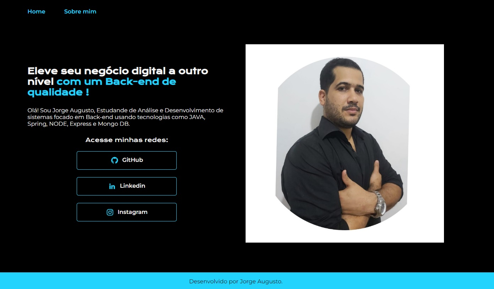

# PORTFÓLIO COMPACTO
---
> Projeto usando JS / HTML / CSS !

   Portfólio compacto, ainda em desenvolvimento!

   
   
   

    

   ###### Técnicas aplicadas:

   - JS
   - Variável CSS
   - RESPONSIVIDADE
   - FLEXBOX

   ###### DESENVOLVIDO POR:

   Jorge Augusto - [linkedin](https://www.linkedin.com/in/jorgeaugusto88/)

   